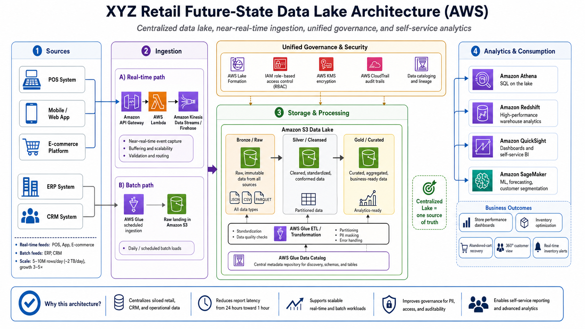
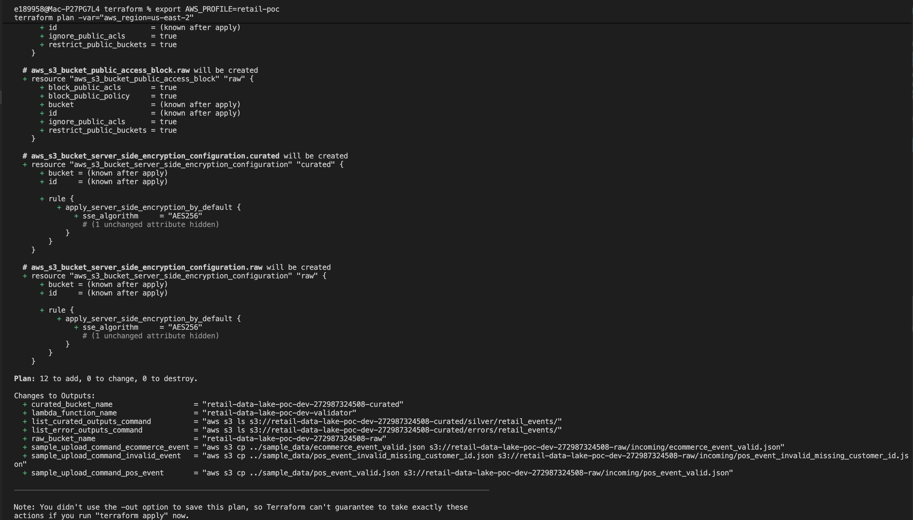
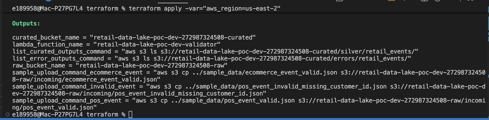
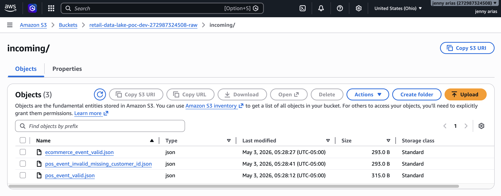
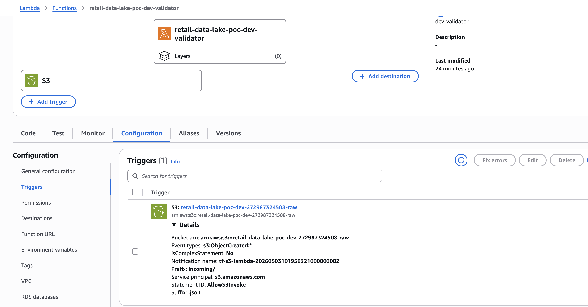
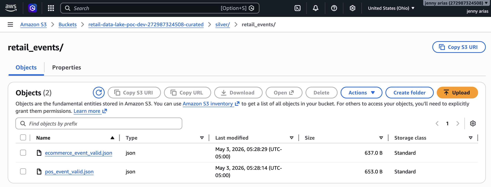
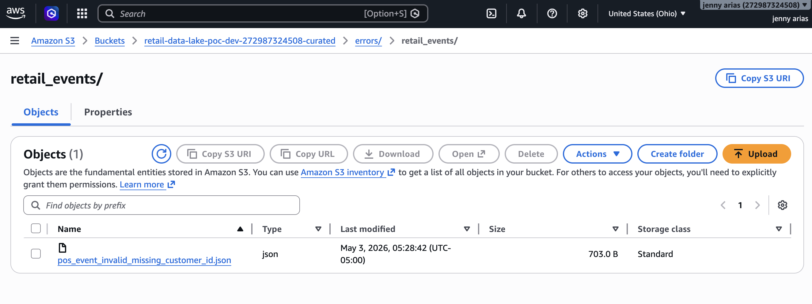
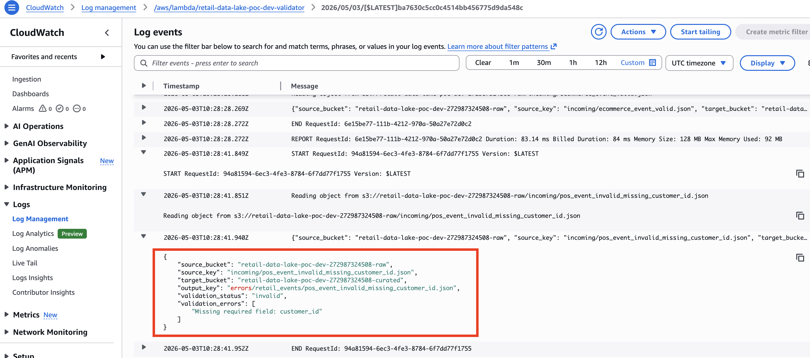
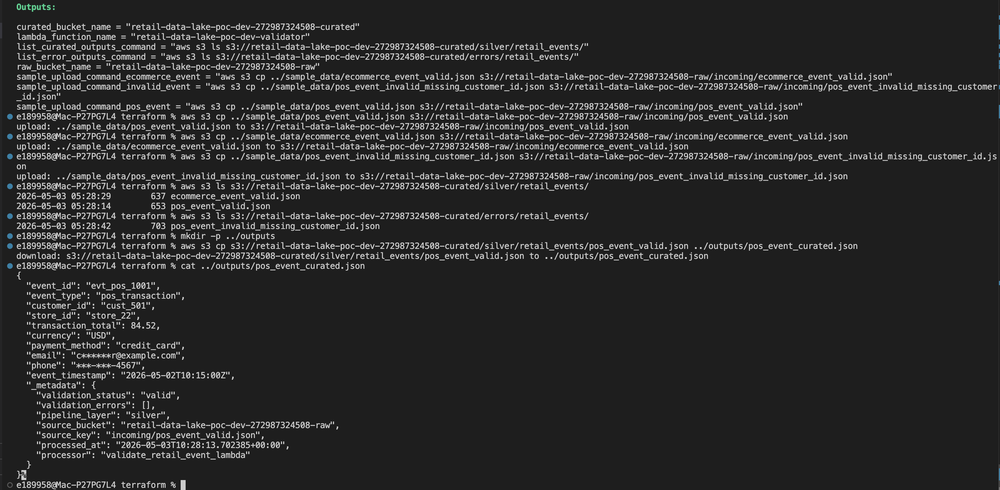
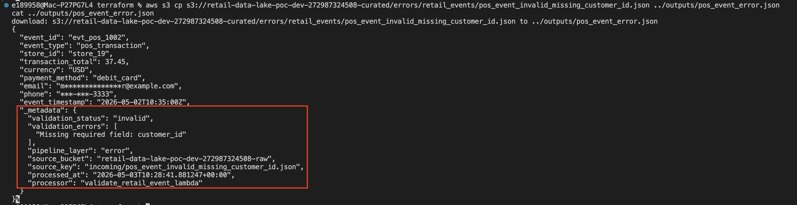

# Retail Data Lake System Design on AWS

## Overview

This project is a system design case study for a retail data lake modernization.

The original assignment was to design an end-to-end future-state architecture for **XYZ Retail**, a global retailer operating across physical stores, mobile apps, web commerce, and internal business systems.

The company needs a centralized cloud data platform that can support:

- Near real-time insights
- Unified reporting
- Governed access to sensitive data
- Self-service analytics
- Advanced analytics and machine learning workloads
- Scalable growth across new regions, mobile apps, and IoT data

This repository turns the assignment into a professional case-study project with two parts:

1. **Future-state architecture design**  
   A proposed AWS data lake architecture that maps business and technical requirements to specific technology choices, benefits, and risks.

2. **Lightweight AWS proof-of-concept**  
   A small working implementation that demonstrates one slice of the architecture using S3, Lambda, Terraform, and CloudWatch.

---

## Assignment Goal

The assignment was to design an end-to-end future-state data lake architecture for XYZ Retail.

The required solution needed to address:

- Centralized storage for retail, CRM, and operational data
- Near real-time ingestion for POS, mobile app, and e-commerce events
- Batch ingestion for ERP and CRM datasets
- Unified governance, access control, cataloging, and PII protection
- Self-service analytics for business users
- Advanced analytics and machine learning enablement
- Scalability for 3–5x expected growth
- Reduction of reporting latency from 24 hours toward approximately 1 hour

This repository presents the proposed architecture, explains the technology decisions, maps requirements to benefits and risks, and includes a small AWS proof-of-concept that implements one working slice of the design.

---

## Business Context

XYZ Retail operates across:

- Physical retail stores
- Mobile applications
- Web commerce channels
- E-commerce transactions
- ERP operational systems
- CRM customer and marketing systems

The company generates large volumes of data across these systems, but the data is currently fragmented across multiple platforms and reporting processes.

This creates delays, inconsistent metrics, redundant storage, and limited ability to make timely business decisions.

---

## Business Problem

XYZ Retail currently faces:

- Delayed decision-making due to overnight batch ETL and slow data availability
- Inconsistent metrics across sales, marketing, and inventory departments
- High maintenance costs from on-premise systems and multiple ETL tools
- Limited scalability to support new regions, mobile apps, and IoT devices
- Compliance gaps around personally identifiable information (PII)

The goal is to modernize the data platform so business teams can access trusted, governed, analytics-ready data faster.

Target success metrics include:

- Report latency reduced from 24 hours toward approximately 1 hour
- Increased percentage of self-service reports
- Improved accuracy of real-time inventory alerts
- Customer satisfaction uplift through better personalization and inventory availability

---

## Key Business Terms

### POS — Point of Sale

A point-of-sale system captures in-store transactions such as purchases, refunds, store location, cashier activity, payment method, and customer interactions.

### ERP — Enterprise Resource Planning

An ERP system tracks core business operations such as inventory, finance, procurement, supply chain, and vendor activity.

### CRM — Customer Relationship Management

A CRM system stores customer profiles, leads, loyalty activity, marketing campaigns, and customer engagement.

### PII — Personally Identifiable Information

PII includes sensitive customer information such as email, phone number, address, and customer name. This data requires encryption, masking, role-based access control, and audit logging.

### Data Lake

A data lake is centralized storage that can hold structured, semi-structured, and unstructured data at scale.

### Medallion Architecture

A medallion architecture organizes data by quality level:

```text
Bronze → Silver → Gold
```

- **Bronze** stores raw source-aligned data
- **Silver** stores cleaned, validated, standardized data
- **Gold** stores business-ready datasets for analytics and reporting

---

## What This Project Covers

- AWS data lake architecture
- Source-to-target data flow mapping
- Batch and near real-time ingestion patterns
- S3 Bronze, Silver, and Gold data layers
- AWS Glue transformation patterns
- Glue Data Catalog metadata management
- Governance and PII protection
- Athena, Redshift, QuickSight, and SageMaker consumption patterns
- Snowflake vs Redshift platform decision considerations
- Terraform infrastructure-as-code
- Serverless event validation with AWS Lambda
- Data quality checks and error routing
- Cloud cost-control and cleanup practices

---

## Proposed Solution Summary

The proposed architecture uses **Amazon S3 as the centralized data lake foundation**.

Data from POS, mobile app, web, e-commerce, ERP, and CRM systems is ingested into the data lake through different ingestion patterns based on data freshness requirements.

Near real-time sources such as POS, mobile app, and e-commerce events flow through an event ingestion path using services such as API Gateway, Lambda, and Kinesis Data Streams or Firehose.

Batch sources such as ERP and CRM datasets are ingested on a schedule using AWS Glue and landed into Amazon S3.

Data then moves through progressive quality layers:

```text
Bronze / Raw → Silver / Cleansed → Gold / Curated
```

The curated Gold data can then be consumed by analytics and business users through tools such as Athena, Redshift, QuickSight, and SageMaker.

---

## Proposed Future-State Architecture Diagram

This diagram is the visual version of the proposed AWS solution.

It maps the business and technical requirements from the assignment into an end-to-end architecture with:

- Source systems
- Near real-time ingestion
- Batch ingestion
- Centralized S3 data lake
- Bronze, Silver, and Gold layers
- Unified governance and security
- Transformation and cataloging
- Analytics and business consumption



This diagram represents the **full proposed future-state architecture** for XYZ Retail.

The lightweight AWS proof-of-concept in this repository implements a smaller working slice of this design:

```text
Raw S3 upload → Lambda validation → Curated/Error S3 output → CloudWatch logs
```

---

## Future-State Data Flow Explained

The diagram above shows the full architecture visually. The text below explains the same future-state flow in plain source-to-target terms.

### Near Real-Time Sources

Near real-time sources include:

- POS system events
- Mobile app events
- Web clickstream events
- E-commerce order events

Proposed flow:

```text
POS / Mobile App / E-commerce Events
    → API Gateway / Lambda / Kinesis Data Streams or Firehose
    → S3 Bronze Raw Zone
    → AWS Glue or Lambda validation
    → S3 Silver Cleansed Zone
    → Gold Curated Datasets
```

This path supports timely use cases such as abandoned-cart recovery, store performance monitoring, and real-time inventory alerts.

### Batch Sources

Batch sources include:

- ERP datasets
- CRM datasets

Proposed flow:

```text
ERP / CRM datasets
    → Scheduled AWS Glue ingestion
    → S3 Bronze Raw Zone
    → AWS Glue transformation
    → S3 Silver Cleansed Zone
    → S3 Gold Curated Zone
```

This path supports operational reporting, inventory analytics, customer segmentation, finance reporting, and marketing analytics.

### Analytics Consumption

Business-ready Gold datasets can be consumed by analytics and machine learning tools.

```text
Gold datasets
    → Athena
    → Redshift
    → QuickSight
    → SageMaker
    → Business users and data scientists
```

Snowflake is documented as an alternative warehouse option in [`architecture/platform-decision.md`](architecture/platform-decision.md), but the primary diagram and implementation focus on the AWS-native path.

---

## Why These Architecture Choices?

| Design Choice | Why It Fits the Assignment |
|---|---|
| Amazon S3 data lake | Centralizes siloed retail, CRM, and operational data at scale |
| Near real-time ingestion for POS/app/e-commerce | Reduces reporting latency and supports timely customer and inventory use cases |
| Batch ingestion for ERP/CRM | Appropriate for scheduled operational datasets that do not need second-by-second processing |
| Bronze/Silver/Gold layers | Separates raw, cleaned, and business-ready data for better quality and trust |
| AWS Glue | Supports scalable batch ingestion, transformation, and metadata cataloging |
| Glue Data Catalog | Provides centralized metadata for discovery, schemas, and query access |
| IAM/RBAC, KMS, CloudTrail, Lake Formation | Supports governance, access control, encryption, and auditability |
| Athena and QuickSight | Enable serverless SQL and self-service BI over curated datasets |
| Redshift | Provides an AWS-native warehouse option for high-performance analytics |
| SageMaker | Supports predictive analytics, forecasting, and customer segmentation |
| Terraform | Makes the proof-of-concept infrastructure repeatable and easy to destroy |

---

## Requirement Mapping

| Requirement | Architecture Choice |
|---|---|
| Reduce report latency from 24 hours to approximately 1 hour | Near real-time ingestion for POS, mobile app, and e-commerce events |
| Consolidate retail, CRM, and operational data | Centralized Amazon S3 data lake |
| Support self-service reporting | Glue Data Catalog, Athena, Redshift, and QuickSight |
| Support predictive analytics | Curated Silver/Gold datasets available for SageMaker |
| Protect PII | IAM, encryption, masking, role-based access control, and audit logging |
| Support 3–5x growth | Scalable managed AWS services and partitioned data lake design |
| Improve data quality | Bronze/Silver/Gold layers, validation rules, curated datasets, and error routing |
| Support batch ERP/CRM data | Scheduled Glue ingestion and transformation |
| Support customer 360 analytics | Combined in-store, online, CRM, and e-commerce data in curated Gold models |

For the full requirement-to-technology mapping, see [`architecture/requirements-mapping.md`](architecture/requirements-mapping.md).

---

## Platform Decision: AWS, Redshift, and Snowflake

The assignment allowed the architecture to be designed on AWS or Snowflake.

This project focuses on an **AWS-native future-state architecture** using Amazon S3 as the centralized data lake foundation.

Within that AWS-native design:

- **Athena** supports serverless SQL directly over curated S3 datasets
- **Redshift** can serve as the AWS-native warehouse layer for high-performance analytics
- **QuickSight** supports dashboards and self-service BI
- **SageMaker** supports advanced analytics and machine learning

Snowflake is still considered as an alternative warehouse option when the organization wants minimal warehouse operations, separate compute for multiple teams, strong data sharing, or multi-cloud flexibility.

For the full Snowflake vs Redshift comparison, see [`architecture/platform-decision.md`](architecture/platform-decision.md).

---

## Lightweight AWS Proof-of-Concept

The full production architecture would require multiple AWS services and larger datasets.

To keep this project cost-conscious, this repository implements a small serverless proof-of-concept:

```text
S3 Raw Bucket → Lambda Validator → S3 Curated/Error Output → CloudWatch Logs
```

This proof-of-concept is not the full production architecture. It is a working demo of one production-relevant slice of the proposed design.

It demonstrates:

- Raw file ingestion into S3
- S3 event notification triggering Lambda
- JSON event validation
- Basic PII masking
- Metadata enrichment
- Valid record routing to a curated Silver prefix
- Invalid record routing to an error prefix
- CloudWatch logging
- Terraform-based infrastructure deployment

---

## Proof-of-Concept Flow

1. Upload a sample POS or e-commerce JSON event to the raw S3 bucket
2. S3 object-created notification triggers the Lambda function
3. Lambda reads the raw JSON file
4. Required fields are validated
5. PII fields are masked
6. Metadata is added to the record
7. Valid records are written to the curated Silver zone
8. Invalid records are written to the error zone
9. Processing activity is visible in CloudWatch logs

---

## Example Raw Event

```json
{
  "event_id": "evt_pos_1001",
  "event_type": "pos_transaction",
  "customer_id": "cust_501",
  "store_id": "store_22",
  "transaction_total": 84.52,
  "currency": "USD",
  "payment_method": "credit_card",
  "email": "customer@example.com",
  "phone": "555-123-4567",
  "event_timestamp": "2026-05-02T10:15:00Z"
}
```

---

## Example Curated Event

```json
{
  "event_id": "evt_pos_1001",
  "event_type": "pos_transaction",
  "customer_id": "cust_501",
  "store_id": "store_22",
  "transaction_total": 84.52,
  "currency": "USD",
  "payment_method": "credit_card",
  "email": "c******r@example.com",
  "phone": "***-***-4567",
  "event_timestamp": "2026-05-02T10:15:00Z",
  "_metadata": {
    "validation_status": "valid",
    "validation_errors": [],
    "pipeline_layer": "silver",
    "source_bucket": "retail-data-lake-poc-dev-raw",
    "source_key": "incoming/pos_event_valid.json",
    "processed_at": "2026-05-03T10:28:13.702385+00:00",
    "processor": "validate_retail_event_lambda"
  }
}
```

---

## Example Invalid Event Outcome

If a required field is missing, the Lambda routes the record to the error prefix.

Example validation metadata:

```json
{
  "_metadata": {
    "validation_status": "invalid",
    "validation_errors": [
      "Missing required field: customer_id"
    ],
    "pipeline_layer": "error",
    "processor": "validate_retail_event_lambda"
  }
}
```

---

## Proof-of-Concept Screenshots

### Terraform Plan



### Terraform Apply Outputs



### Raw S3 Upload



### Lambda S3 Trigger



### Curated S3 Output



### Error Record Output



### CloudWatch Logs



### Valid Curated Output in Terminal



### Invalid Error Output in Terminal



---

## How to Deploy the Proof-of-Concept

This proof-of-concept was tested in a personal AWS account using the `us-east-2` region.

Navigate to the Terraform folder:

```bash
cd terraform
```

Set the AWS CLI profile for the current terminal session:

```bash
export AWS_PROFILE=retail-poc
```

Initialize Terraform:

```bash
terraform init
```

Validate Terraform:

```bash
terraform validate
```

Preview resources:

```bash
terraform plan -var="aws_region=us-east-2"
```

Deploy:

```bash
terraform apply -var="aws_region=us-east-2"
```

Upload a sample valid POS event:

```bash
aws s3 cp ../sample_data/pos_event_valid.json s3://<raw-bucket-name>/incoming/pos_event_valid.json
```

Upload a sample valid e-commerce event:

```bash
aws s3 cp ../sample_data/ecommerce_event_valid.json s3://<raw-bucket-name>/incoming/ecommerce_event_valid.json
```

Upload a sample invalid event:

```bash
aws s3 cp ../sample_data/pos_event_invalid_missing_customer_id.json s3://<raw-bucket-name>/incoming/pos_event_invalid_missing_customer_id.json
```

List valid curated outputs:

```bash
aws s3 ls s3://<curated-bucket-name>/silver/retail_events/
```

List invalid/error outputs:

```bash
aws s3 ls s3://<curated-bucket-name>/errors/retail_events/
```

Destroy resources after testing:

```bash
terraform destroy -var="aws_region=us-east-2"
```

If Terraform cannot delete the S3 buckets because they contain files, empty the buckets first:

```bash
aws s3 rm s3://<raw-bucket-name> --recursive
aws s3 rm s3://<curated-bucket-name> --recursive
```

Then rerun:

```bash
terraform destroy -var="aws_region=us-east-2"
```

---

## Repository Structure

```text
retail-data-lake-system-design/
├── README.md
├── architecture/
│   ├── architecture-diagram.png
│   ├── architecture-overview.md
│   ├── platform-decision.md
│   └── requirements-mapping.md
├── docs/
│   ├── architecture-decisions.md
│   ├── cost-control.md
│   ├── data-quality-rules.md
│   ├── operational-runbook.md
│   └── security-governance.md
├── sample_data/
│   ├── ecommerce_event_valid.json
│   ├── pos_event_invalid_missing_customer_id.json
│   └── pos_event_valid.json
├── screenshots/
│   ├── 01_terraform_plan.png
│   ├── 02_terraform_apply_outputs.png
│   ├── 03_raw_s3_upload.png
│   ├── 04_lambda_s3_trigger.png
│   ├── 05_curated_s3_output.png
│   ├── 06_error_record_output.png
│   ├── 07_cloudwatch_logs.png
│   ├── 08_terminal_valid_curated_output.png
│   ├── 09_terminal_invalid_error_output.png
│   └── README.md
├── src/
│   └── lambda/
│       └── validate_retail_event.py
└── terraform/
    ├── main.tf
    ├── outputs.tf
    ├── README.md
    └── variables.tf
```

---

## Supporting Documentation

| Document | Purpose |
|---|---|
| [`architecture/architecture-overview.md`](architecture/architecture-overview.md) | Explains the proposed future-state architecture in more detail |
| [`architecture/requirements-mapping.md`](architecture/requirements-mapping.md) | Maps business and technical requirements to technology choices, benefits, risks, and mitigations |
| [`architecture/platform-decision.md`](architecture/platform-decision.md) | Compares Snowflake and Redshift as warehouse options |
| [`docs/architecture-decisions.md`](docs/architecture-decisions.md) | Explains why major architecture choices were made |
| [`docs/security-governance.md`](docs/security-governance.md) | Describes PII, IAM, encryption, audit, and governance considerations |
| [`docs/data-quality-rules.md`](docs/data-quality-rules.md) | Documents validation rules used in the Lambda proof-of-concept |
| [`docs/cost-control.md`](docs/cost-control.md) | Explains how the proof-of-concept was scoped to control AWS cost |
| [`docs/operational-runbook.md`](docs/operational-runbook.md) | Provides step-by-step deployment, testing, verification, and cleanup instructions |
| [`terraform/README.md`](terraform/README.md) | Explains the Terraform proof-of-concept infrastructure |

---

## Key Takeaway

This project demonstrates how a retail company can modernize siloed systems into a centralized, governed AWS data lake.

The proposed future-state design supports:

- Near real-time ingestion
- Batch ingestion
- Centralized S3 storage
- Bronze/Silver/Gold data layers
- Unified governance
- PII protection
- Self-service BI
- Advanced analytics and machine learning readiness

The lightweight proof-of-concept demonstrates one working slice of that design by validating raw retail events, masking sensitive fields, and routing records into curated or error outputs using serverless AWS services.

---

## Real-World Data Engineering Connection

This project mirrors common data engineering work in large organizations:

- Translating business requirements into a technical architecture
- Designing source-to-target data flows
- Separating raw, cleaned, and curated data layers
- Applying data quality checks before analytics consumption
- Protecting sensitive customer data
- Building cloud-native, scalable data platforms
- Documenting architecture decisions and tradeoffs
- Creating lightweight proof-of-concepts before full production implementation
- Using Terraform to make infrastructure repeatable and reviewable

---

## References

- AWS Lambda with Amazon S3 event notifications
- Amazon S3 documentation
- AWS Glue Data Catalog documentation
- Amazon Athena documentation
- AWS Lake Formation documentation
- AWS Well-Architected Framework